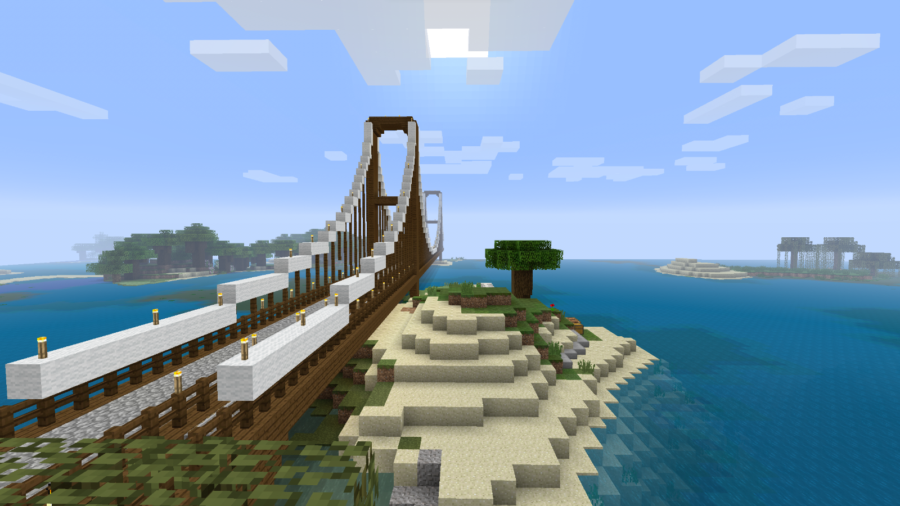

# fgh

### GitHub Username: [bor-real](https://github.com/bor-real)
### Platform: Minecraft Xbox 360 Edition (Xenia-canary)
### Version: TU70

## If this save was made with an emulator, please state which emulator, and the version. If not, put "None"
### Emulator: Xenia-canary (3e55d0048)

# Screenshots

# Extra Info

This has been my main Survival world since Feburary 18th, 2024. I \(regrettably\) chose to use Xenia because that is the version I grew up on and I did not know RPCN or Pretendo existed.
