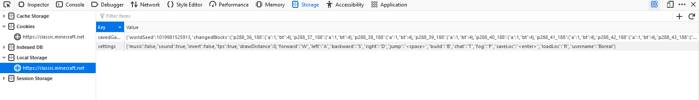
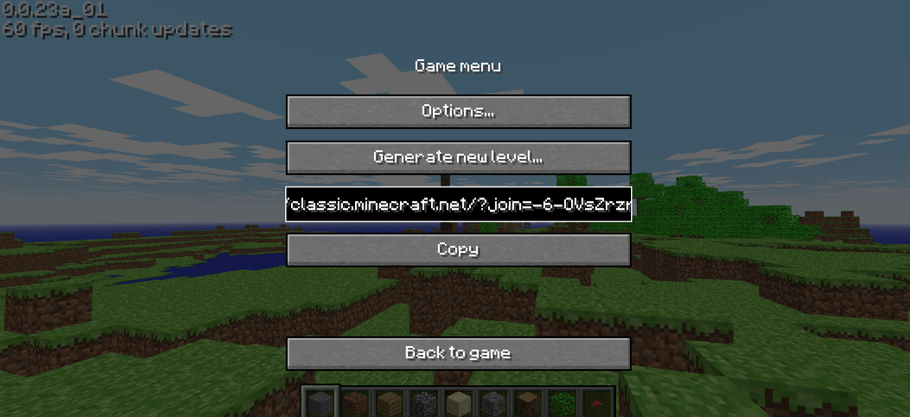

# New World

### GitHub Username: [bor-real](https://github.com/bor-real)
### Platform: Minecraft Classic (remake)
### Version: 0.0.23a_01 (classic.minecraft.net)

# Screenshots

The remake of Microsoft Classic does not have a save selector, so the save file must be replaced manually.

# Extra Info

### Place any extra info here, such as info about builds, etc.

The save is stored in the savedGame key of localStorage, which can be accessed with most browsers devtools.
