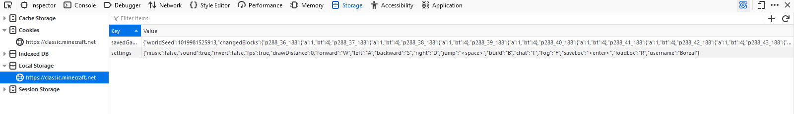
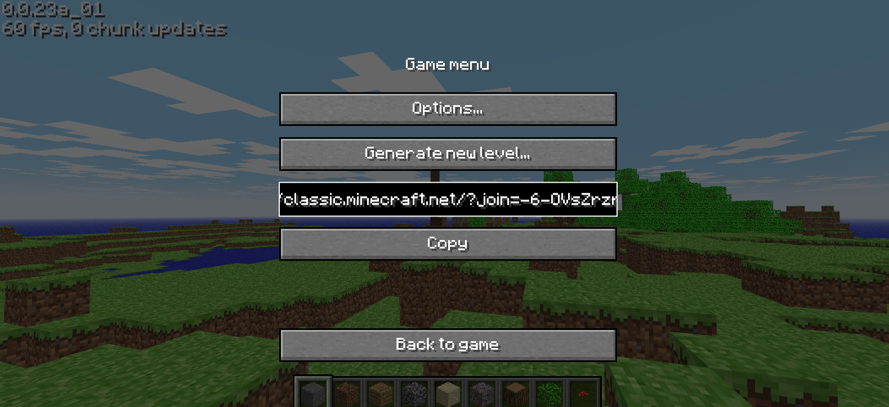

# savedGame

- GitHub Username: [bor-real](https://github.com/bor-real)
- Platform: Minecraft Classic Remake (classic.minecraft.net)
- Version: 0.0.23a_01 (classic.minecraft.net)
- Emulator: None

## Screenshots

The remake of Microsoft Classic does not have a save selector, so the save file must be replaced manually.

## Extra Info

The save is stored in the savedGame key of localStorage, which can be accessed with most browsers devtools.
